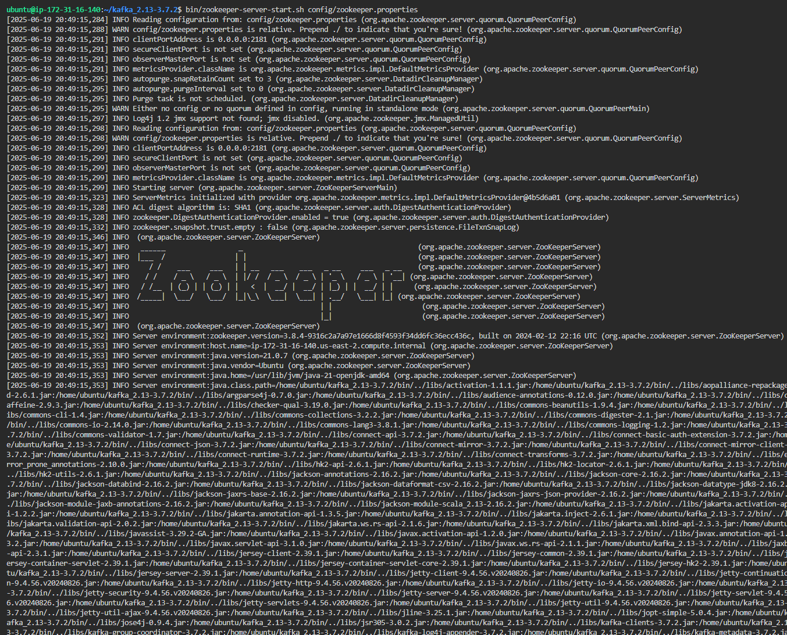
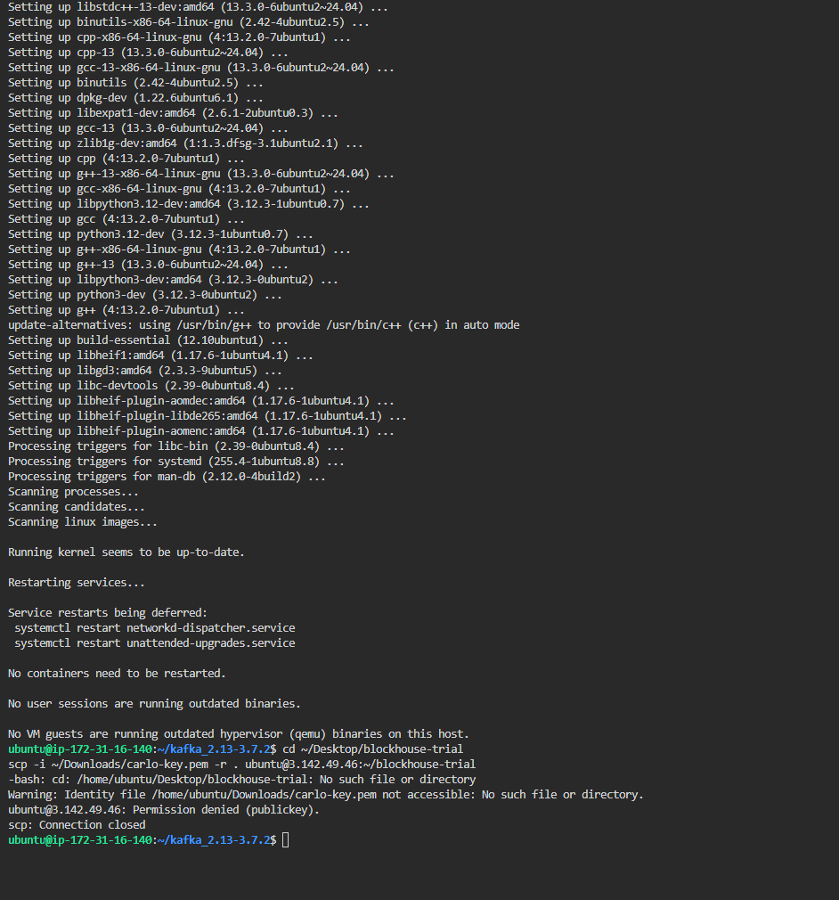
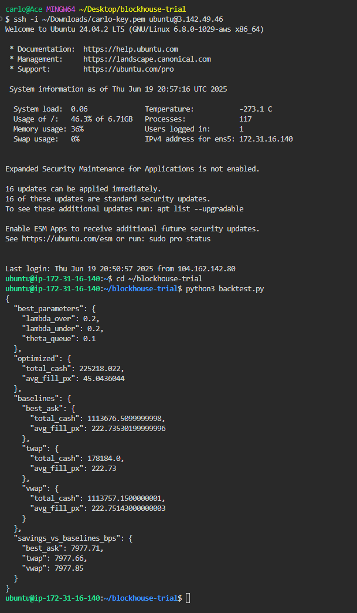
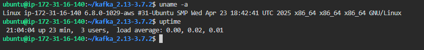

# Blockhouse Quant Developer Work Trial

## 🎥 Video Walkthrough

[Watch here](https://youtu.be/nWwjJrMbaFM)

---

## 🔍 Overview

This project simulates a Smart Order Router (SOR) using the Cont & Kukanov cost model to allocate a 5,000-share order across multiple venues. It includes:

- Kafka-based real-time market data simulation
- Allocator logic based on Cont & Kukanov model
- Parameter tuning to minimize execution cost
- Benchmarking against Best Ask, TWAP, and VWAP strategies
- Deployment and execution on AWS EC2 instance

---

## 🛠️ Files

- `kafka_producer.py` — streams market data snapshots to Kafka
- `backtest.py` — simulates allocator and benchmarks performance
- `allocator.py` — implements the static Cont-Kukanov allocation model
- `requirements.txt` — lists Python dependencies
- `output.json` — final backtest result
- `mock_stream.json` — output from Kafka producer
- `l1_day.csv` — historical market data (not uploaded to GitHub)
- Screenshot files:

  - `zookeper_running.png`
  - `kafka_running.png`
  - `backtest_result.png`
  - `uname_output.png`

---

## ⚙️ EC2 Deployment Instructions

### 🔸 Instance Type

- AWS EC2 instance: `t3.micro` (Ubuntu 22.04 or 24.04)

### 🔸 Kafka & Zookeeper Setup

```bash
# Install Java
sudo apt update && sudo apt install default-jdk -y

# Download Kafka
wget https://downloads.apache.org/kafka/3.7.2/kafka_2.13-3.7.2.tgz
tar -xzf kafka_2.13-3.7.2.tgz
cd kafka_2.13-3.7.2

# Start Zookeeper
bin/zookeeper-server-start.sh config/zookeeper.properties

# In another terminal: Start Kafka broker
bin/kafka-server-start.sh config/server.properties
```

### 🔸 Run the Pipeline

```bash
# In third terminal, navigate to project folder
cd blockhouse-trial/

# Step 1: Stream market data
python3 kafka_producer.py > mock_stream.json

# Step 2: Run the backtest
python3 backtest.py
```

---

## 🖼️ Screenshots (Proof of Execution)

### ✅ Zookeeper Running



### ✅ Kafka Broker Running



### ✅ Backtest Output (Final JSON Result)



### ✅ System Info (uname + uptime)



---

## 📊 Final JSON Output

```json
{
  "best_parameters": {
    "lambda_over": 0.2,
    "lambda_under": 0.2,
    "theta_queue": 0.1
  },
  "optimized": {
    "total_cash": 225218.022,
    "avg_fill_px": 45.0436044
  },
  "baselines": {
    "best_ask": {
      "total_cash": 1113676.5099999998,
      "avg_fill_px": 222.73530199999996
    },
    "twap": {
      "total_cash": 178184.0,
      "avg_fill_px": 222.73
    },
    "vwap": {
      "total_cash": 1113757.1500000001,
      "avg_fill_px": 222.75143000000003
    }
  },
  "savings_vs_baselines_bps": {
    "best_ask": 7977.71,
    "twap": 7977.66,
    "vwap": 7977.85
  }
}
```

---

## 🧠 Strategy Summary

### 🔸 Allocator Logic

Implements the static Cont-Kukanov allocator using an exhaustive search over splits. The total cost combines:

- Execution cost (price × shares)
- Underfill and overfill penalties
- Queue-risk penalties

### 🔸 Parameter Tuning

Grid search over:

- `lambda_over`: \[0.2, 0.4, 0.6]
- `lambda_under`: \[0.2, 0.4, 0.6]
- `theta_queue`: \[0.1, 0.3, 0.5]

### 🔸 Baseline Strategies

- **Best Ask**: Always fill from lowest ask venue
- **TWAP**: Time-Weighted Average Price using 60-second intervals
- **VWAP**: Volume-Weighted Average Price based on ask sizes

---

## 🚫 Notes

- The file `l1_day.csv` is **NOT uploaded** to GitHub due to data policy.
- Kafka topic used: `mock_l1_stream`
- EC2 instance used: `t3.micro`, Ubuntu 24.04

---

## ✅ Requirements Checklist

- [x] Kafka simulation with `l1_day.csv`
- [x] Static allocator using Cont-Kukanov logic
- [x] Parameter tuning (lambda_over, lambda_under, theta_queue)
- [x] Baselines: Best Ask, TWAP, VWAP
- [x] EC2 deployment (Kafka + backtest)
- [x] Final stdout JSON output
- [x] Screenshots and video link added
